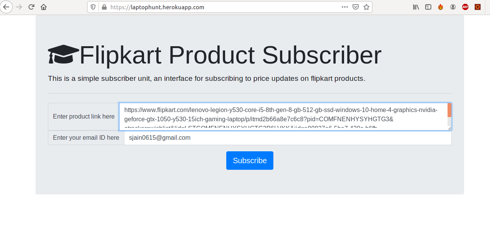
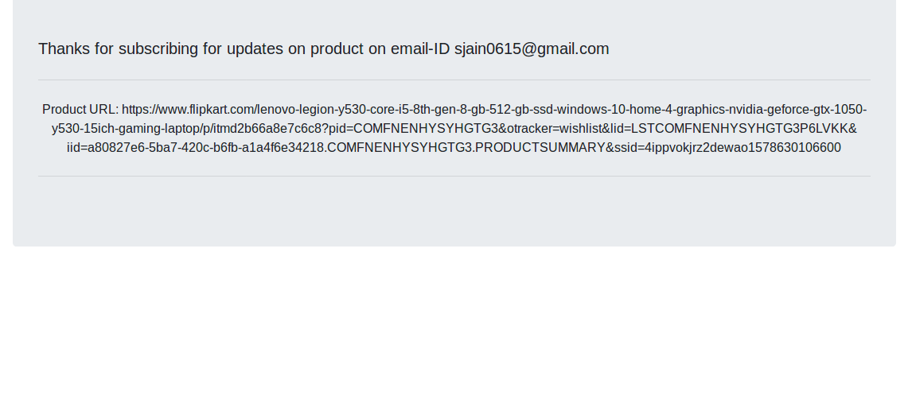

`priceTracker` is the easiest way to subscribe to email notification for Flipkart price drop alerts.





**Demo**
---
Here is a live working demo :  https://laptophunt.herokuapp.com

**Usage**
---

```
dir:   source
Usage: server.py [OPTIONS]

  Subscribe to email updates for Flipkart product.

Options:
  -host  The host of the server(eg. 0.0.0.0)
  -port  The port of the server(eg. 8500)
  -debug, True/False
```
```
dir:   cronapp
Usage: mailer.py [OPTIONS]

  Sends email updates at regular intervals.

Options:
  -classId  class for scrapping 
  -interval Time interval between each notification(eg. 15)
```
Developed by Shreyansh Jain -> (Github: desiredeveloper)

**Installation Options**
---

Install with [`pip`]
+ `$ cd source`
+ `$ pip install -r requirements.txt`

+ `$ cd cronapp`
+ `$ pip install -r requirements.txt`


**How to Contribute**
---

1. Clone repo and create a new branch: `$ git checkout https://github.com/desiredeveloper/Price-Tracker -b name_for_new_branch`.
2. Make changes and test
3. Submit Pull Request with comprehensive description of changes

If you find a bug or like to request a new function, feel free to do so by opening an issue [here](https://github.com/desiredeveloper/Price-Tracker/issues/new).


**To Do**
---

1. Proper error/exception handling is to be done.
2. Graph plots for price trends.
3. User Authentication/authorisation.
4. Scrap amazon products using same app by giving appropriate class.


## [License](https://github.com/desiredeveloper/Price-Tracker/blob/master/LICENSE.md)

MIT © [Shreyansh Jain ](https://github.com/desiredeveloper)

